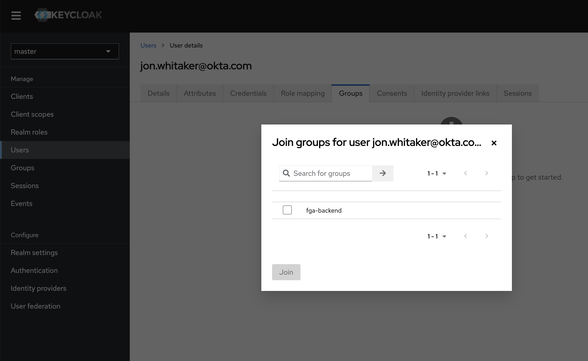

# Federated IAM for Kubernetes with OpenFGA
An sample repository demonstrating how to federate Identity based policies and Access Management based policies between Kubernetes and Keycloak.

## Certificate Generation
### Keycloak
```
mkdir -p certs/keycloak && cd certs/keycloak

cat << EOF > req.cnf
[req]
req_extensions = v3_req
distinguished_name = req_distinguished_name

[req_distinguished_name]

[ v3_req ]
basicConstraints = CA:FALSE
keyUsage = nonRepudiation, digitalSignature, keyEncipherment
subjectAltName = @alt_names

[alt_names]
DNS.1 = keycloak
EOF

openssl genrsa -out ca-key.pem 2048

openssl req -x509 -new -nodes -key ca-key.pem -days 180 -out ca.pem -subj "/CN=kube-ca"

openssl genrsa -out key.pem 2048

openssl req -new -key key.pem -out csr.pem -subj "/CN=kube-ca" -config req.cnf

openssl x509 -req -in csr.pem -CA ca.pem -CAkey ca-key.pem -CAcreateserial -out cert.pem -days 180 -extensions v3_req -extfile req.cnf
```

### OpenFGA Webhook Authorizer
```
mkdir -p certs/authorizer && cd certs/authorizer

openssl genrsa -out ca.key 2048

openssl req -x509 -new -nodes -key ca.key -subj "/CN=127.0.0.1" -days 180 -out ca.crt

openssl genrsa -out server.key 2048
openssl req -new -key server.key -out server.csr -config csr.conf

openssl x509 -req -in server.csr -CA ca.crt -CAkey ca.key \
    -CAcreateserial -out server.crt -days 180 \
    -extensions v3_ext -extfile csr.conf -sha256
```

## 1. Start OpenFGA and bootstrap
```shell
docker compose up openfga -d

export STORE_ID=$(fga store create --name kube-demo --model model.fga | jq -r .store.id)

yq -i '.fgaStoreID = env(STORE_ID)' config/authorizer-config.yaml
```

## 2. Start Keycloak with OpenFGA extension
```shell
docker compose up keycloak keycloak-import -d
```

## 3. Start Kubernetes API Server
Start the Kubernetes API server with OIDC wired up with Keycloak and the OpenFGA Webhook Authorizer.

```
docker compose up api authorizer etcd -d
```

## 4. Apply the Kubernetes RBAC policies
```
kubectl apply -f rbac.yaml
```

## 5. List deployments
Attempt to list the deployments in the `fga-backend` namespace.

> **Note:** before runnig the command below make sure to Authenticate using OIDC. See [Kubectl OIDC Login](#kubectl-oidc-login) section below.


```
kubectl --user=oidc get deployment --namespace fga-backend

Please visit the following URL in your browser: http://localhost:8000
```
It wil ask you to visit a redirect URL which is the authentication callback. Follow the link and authenticate.

You should get an unauthorized response, because we haven't the user to any groups yet. For example:

```
Error from server (Forbidden): deployments.apps is forbidden: User "b4479454-c593-48f1-a600-37e09ddceb74" cannot list resource "deployments" in API group "apps" in the namespace "fga-backend"
```

## 6. Add the user to a group in Keycloak
In the Keycloak Administration Dashboard add a user, such as `jon.whitaker@okta.com` to the `fga-backend` group.




## 6. List deployments
Let's list deployents in the `fga-backend` namespace again, but this time we should see an authorized response.

```
kubectl --user=oidc get deployment --namespace fga-backend

Please visit the following URL in your browser: http://localhost:8000
```

Authenticate as the user who you added to the `fga-backend` group.

Now we see a different response:
```
No resources found in fga-backend namespace.
```
This indicates the request is authorized but we don't have any deployments in the namespace.

So this shows that we can modify identity based policies in Keycloak and have them influence access control decision in OpenFGA.

## 7. Remove the user from the group

Remove the user from the `fga-backend` group.

## 8. Temporarily add the user to the group using the FGA CLI

We can enforce temporal access to a group by writing a [Conditional Relationship Tuple](https://openfga.dev/docs/concepts#:~:text=A%20conditional%20relationship%20tuple%20is,the%20evaluation%20of%20a%20condition.) to OpenFGA. 

This could be a feature in Keycloak natively if Keycloak integrated with OpenFGA natively for user-->group management, but since this feature doesn't exist in Keycloak we're simulating what it might look like.

Add the user (assign `$USER_ID` to the user's id) to the `fga-backend` group conditioned on a temporal access policy. In this example we grant the group relationship at timestamp '2024-03-21T16:00:00Z' (RFC3339 formatted timetamp) for 70s. The group relationship will expire 10s after the top of the minute, so at '2024-03-21T16:01:10Z' the group membership will expire.

```
fga tuple write --store-id=$STORE_ID user:$USER_ID assignee group:fga-backend --condition-name temporal_grant --condition-context '{"grant_timestamp":"2024-03-21T16:00:00Z", "grant_duration": "70s"}'
```

## 9. Wait for the grant to expire
After the temporal grant above has expired, make sure the user no longer has access.

```
kubectl --user=oidc get deployment --namespace fga-backend
```

If you got your timestamps right, then you should get an unauthorized response again:
```
Error from server (Forbidden): deployments.apps is forbidden: User "b4479454-c593-48f1-a600-37e09ddceb74" cannot list resource "deployments" in API group "apps" in the namespace "fga-backend"
```

🎉 Congratulations you've just shown how to federate Identity AND Access Management based policies across multiple systems, and we showed that we can enforce complex policies involving more advanced models such as temporal access. Pretty cool stuff!

## Kubectl OIDC Login
> ⚠️ Need to switch the command below to not skip tls verification

```shell
kubectl oidc-login setup --oidc-issuer-url https://keycloak:8443/realms/master --oidc-client-id kube-gatekeeper  --insecure-skip-tls-verify

kubectl config set-credentials oidc \
  --exec-api-version=client.authentication.k8s.io/v1beta1 \
  --exec-command=kubectl \
  --exec-arg=oidc-login \
  --exec-arg=get-token \
  --exec-arg=--oidc-issuer-url=https://keycloak:8443/ \
  --exec-arg=--oidc-client-id=kube-gatekeeper
  --skip-open-browser
```

## Helpful Links
* https://kubernetes.io/docs/reference/access-authn-authz/authentication/
* https://kubernetes.io/docs/reference/access-authn-authz/authorization/
* https://minikube.sigs.k8s.io/docs/tutorials/openid_connect_auth/
* https://github.com/int128/kubelogin/blob/master/docs/setup.md